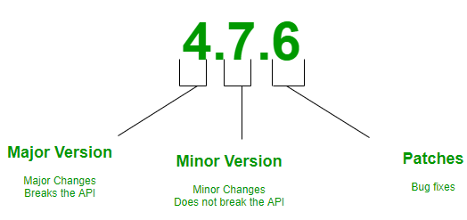
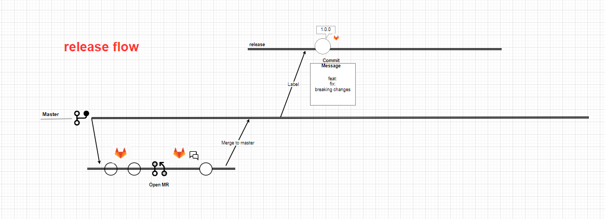
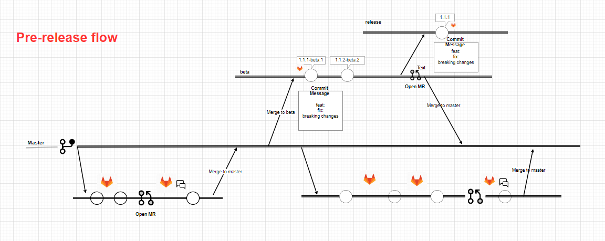

# Semantic Versioning

## Introduction to Semantic Versioning
Semantic versioning (also known as SemVer) is a versioning system that has been on the rise over the last few years. It has always been a problem for software developers, release managers and consumers. Having a universal way of versioning the software development projects is the best way to track what is going on with the software as new plugins, addons, libraries and extensions are being built almost every day. This problem can be solved by Semantic Versioning. In brief, it’s a way for numbering the software releases.

So, SemVer is in the form of Major.Minor.Patch

Semantic Versioning is a 3-component number in the format of X.Y.Z, where :

* X stands for a major version. The leftmost number denotes a major version. When you increase the major version number, you increase it by one but you reset both patch version and minor versions to zero. If the current version is 2.6.9 then the next upgrade for a major version will be 3.0.0. Increase the value of X when breaking the existing API.
* Y stands for a minor version. It is used for the release of new functionality in the system. When you increase the minor version, you increase it by one but you must reset the patch version to zero. If the current version is 2.6.9 then the next upgrade for a minor version will be 2.7.0. Increase the value of Y when implementing new features in a backward-compatible way.
* Z stands for a Patch Versions: Versions for patches are used for bug fixes. There are no functionality changes in the patch version upgrades. If the current version is 2.6.9 then the next version for a patch upgrade will be 2.6.10. There is no limit to these numbers. Increase the value of Z when fixing bugs
Valid identifiers are in the set [A-Za-z0-9] and cannot be empty. Pre-release metadata is identified by appending a hyphen to the end of the SemVer sequence. Thus a pre-release for version 1.0.0 could be 1.0.0-alpha.1. Then if another build is needed, it would become 1.0.0-alpha.2, and so on. Note that names cannot contain leading zeros, but hyphens are allowed in names for pre-release identifiers.

## How does it work?
semantic-release uses the commit messages to determine the consumer impact of changes in the codebase. Following formalized conventions for commit messages, semantic-release automatically determines the next semantic version number, generates a changelog and publishes the release.

By default, semantic-release uses Angular Commit Message Conventions. The commit message format can be changed with the preset or config options of the @semantic-release/commit-analyzer and @semantic-release/release-notes-generator plugins.

The table below shows which commit message gets you which release type when semantic-release runs (using the default configuration):

Commit  message	                                        | Release type
----------------                                        |-------------
fix(pencil):                                            |  Fix Release
feat(pencil):                                           | Feature Release
perf(pencil): BREAKING CHANGE: The graphiteWidth option has been removed.The default graphite width of 10mm is always used for performance reasons.	|  Breaking Release (Note that the BREAKING CHANGE:  token must be in the footer of the commit)

## Triggering a release
For each new commit added to one of the release branches (for example: master, next, beta), with git push or by merging a pull request or merging from another branch, a CI build is triggered and runs the semantic-release command to make a release if there are codebase changes since the last release that affect the package functionalities.

semantic-release offers various ways to control the timing, the content and the audience of published releases. See example workflows in the following recipes:

### release channels

### Pre-releases    
We now decide to work on a future major release, which will be composed of multiple features, some of them being breaking changes. We want to publish our package for each new feature developed for test purpose, however we do not want to increment our package version or make it available to our users until all the features are developed and tested.

To implement that workflow we can create the branch beta and commit our first feature there. When pushing that commit, semantic-release will publish the pre-release version 2.0.0-beta.1 on the dist-tag @beta. That allow us to run integration tests by installing our module with npm install example-module@beta. Other users installing with npm install example-module will still receive the version 1.0.0.

The Git history of the repository is now:

* feat: initial commit # => v1.0.0 on @latest
  | \
  |  * feat: first feature \n\n BREAKING CHANGE: it breaks something # => v2.0.0-beta.1 on @beta
  We can continue to work on our future release by committing and pushing other features or bug fixes on the beta branch. With each push, semantic-release will publish a new pre-release on the dist-tag @beta, which allow us to run our integration tests.

With another feature, the Git history of the repository is now:

* feat: initial commit # => v1.0.0 on @latest
  | \
  |  * feat: first feature \n\n BREAKING CHANGE: it breaks something # => v2.0.0-beta.1 on @beta
  |  * feat: second feature # => v2.0.0-beta.2 on @beta

### Maintenance releases
